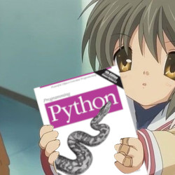

<h1 align="center">
  <br>
    <a href=""></a>
  <br>
</h1>

# Fedora-Optimized

This is a collection of scripts and configuration files that I use to optimize my Fedora installation.

RPM Fusion is a third-party software repository for Fedora and Fedora derivatives, which provides software that is not
available in the official Fedora repositories due to legal or patent restrictions. The Nonfree repository contains
proprietary software.
---

| Distro | Dependencies                                                                          |
|--------|---------------------------------------------------------------------------------------|
| Debian | sudo apt update && sudo apt install unrar p7zip-full p7zip-rar unzip gzip git python3 |
| Fedora | sudo dnf install p7zip p7zip-plugins unrar unzip gzip git python3                     |

## Features

| Features | Description                 |
|----------|-----------------------------|
| NonFree  | Proprietary Software        |
| Cuda     | Nvidia Support              |
| Tools    | bat, lsd, dnf5 and kitty    |
| alias    | some aliases for some tools |
---
## Install

```bash
    git clone https://github.com/AydroPunk/Fedora-Optimized.git &&
    cd Fedora-Optimized &&
    sudo python3 script.py &&
    cd .. &&
    rm -rf Fedora-Optimized &&
    source ~/.zshrc
```
---
## IMPORTANT

- Execute the script as root